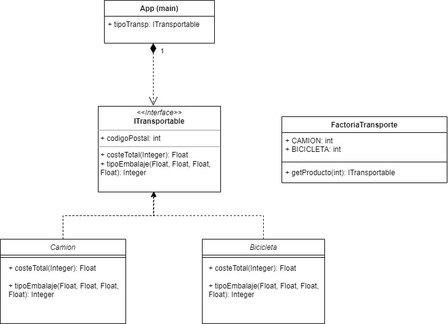

# FACTORÍA DE TRANSPORTE

Este proyecto consiste en indicar cuál es el coste total de un envío y el tipo de embalaje empleado, 
según el tipo de transporte utilizado. Está basado en el patrón Factory.Explicaré brevemente los pasos
a seguir:

#### **- Diagrama de clases**
Primero realizo el diagrama para tener una idea de lo que vamos a tratar en el proyecto, e iré complentándolo
hasta que finalmente queda así:



#### **- ITransportable**
Es una interfaz en la cual creo dos métodos abstractos que implementaré despúes en las clases 
Camion y Bicicleta.
Por lo tanto, el código resultante es el siguiente:

```
     Float costeTotal(Integer cp);
     Integer tipoEmbalaje(Float dX, Float dY, Float dZ, Float peso);
```

También declaro la variable codigoPostal para así comparar el cp enviado con éste y saber 
cuánto me costará.

#### **- Bicicleta**
En esta clase y como dije anteriormente, implemento los métodos de la interfaz según 
lo que me pidan, quedando los métodos de esta forma:

```
public Float costeTotal(Integer cp) 
Float precio;
        if (cp < codigoPostal) {

            precio = 40.0F;

        } else {
            precio = 70.0F;
        }

        return precio;
    }

public Integer tipoEmbalaje(Float dX, Float dY, Float dZ, Float peso) {

        Float dimensionTotal = (dX * dY * dZ);

        if (dimensionTotal < 10000 && peso < 5) {
            System.out.println("El tipo de embalaje es: palet");
            return 0;

        } else if (dimensionTotal > 10000 && dimensionTotal < 30000 && peso > 15) {
            System.out.println("El tipo de embalaje es: caja de cartón");
            return 1;

        } else {
            System.out.println("El tipo de embalaje es: caja de madera");
            return 2;
        }

    }
```

#### **- Camion**
En esta clase y como dije anteriormente, implemento los métodos de la interfaz según 
lo que me pidan, quedando los métodos de la misma forma que en la clase Bicicleta 
pero con distintas dimensiones, peso y precio.

En ambas clases declaro las constantes literales que me indican que tipo de embalaje es
(palet, caja de cartón o caja de madera).


#### **- FactoriaTransporte**
Declaro constantes literales para los tipos de transporte Camion y Bicicleta.
Se crea un método para que, mandando una opción, me devuelva el transporte correspondiente.

```
 public static ITransportable getProducto(int opcion) {

        switch (opcion) {

            case CAMION:
                return new Camion();

            case BICICLETA:
                return new Bicicleta();

            default:
                return null;

        }
 ```       

#### **- Main**
Creo un objeto de tipo static para poder llamar a la FactoriaTransporte.

```
static ITransportable tipoTransp;
```

Con ese objeto, puedo calcular el coste del envío y el tipo de embalaje
para ambos tipos de transporte.

```
tipoTransp = FactoriaTransporte.getProducto(FactoriaTransporte.CAMION);
        System.out.println("El coste total del envío es: " + tipoTransp.costeTotal(10500) + " euros");
        System.out.println(tipoTransp.tipoEmbalaje(70F, 70F, 70F, 45F));
```    
Sería lo mismo para Bicicleta, cambiando las dimensiones y peso.


